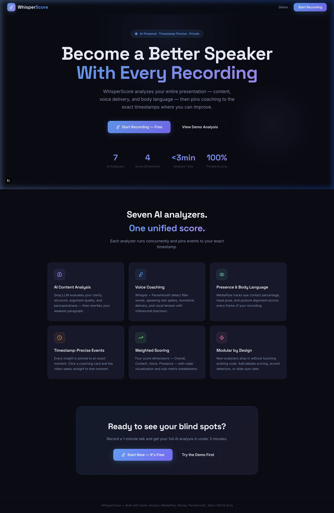
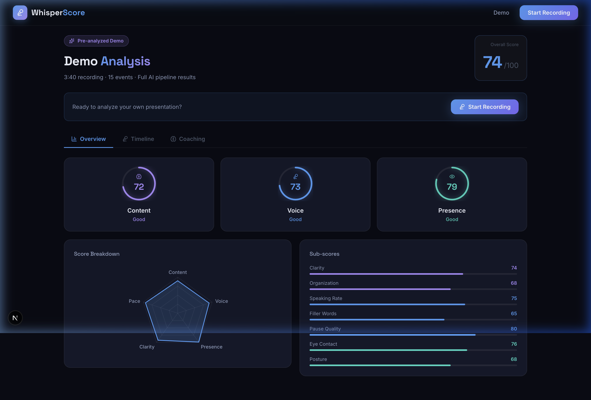
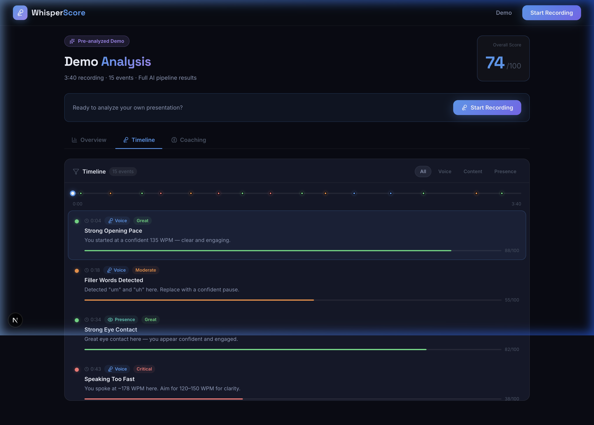

<div align="center">

# 🎙️ WhisperScore

### AI Public Speaking & Debate Coach

**Record → Analyze → Improve**  
Seven concurrent AI analyzers. Timestamp-precise coaching. 100% local & private.

[](LICENSE)
[](https://python.org)
[](https://nextjs.org)
[](https://fastapi.tiangolo.com)

</div>

---



---

## ✨ What It Does

WhisperScore listens to your presentation, watches your body language, reads your content — then pins coaching feedback to the exact second you need to improve.

| Dimension | Powered By | What You Get |
|-----------|-----------|-------------|
| 🧠 **Content** | Groq LLM (LLaMA 3) | Clarity, structure, argument strength, persuasiveness, improved excerpt |
| 🎙️ **Voice** | faster-whisper · Silero VAD · librosa · Parselmouth | WPM, filler words, pause quality, pitch variation, vocal energy |
| 👁️ **Presence** | OpenSeeFace · RTMPose (rtmlib) | Eye contact %, gaze direction, blink rate, head pose, posture, gesture symmetry |

---

## 📸 Screenshots

<table>
  <tr>
    <td><strong>Analysis Dashboard</strong></td>
    <td><strong>Interactive Timeline</strong></td>
  </tr>
  <tr>
    <td></td>
    <td></td>
  </tr>
</table>

---

## 🏗️ Architecture

```
Here_goes_nothing/
├── backend/                    # FastAPI + 7 concurrent ML analyzers
│   ├── analyzers/
│   │   ├── base.py             # BaseAnalyzer plugin interface
│   │   ├── content/            # LLM content scoring (Groq)
│   │   ├── speech/             # VAD, transcription, pace, fillers
│   │   ├── video/
│   │   │   ├── face.py         # OpenSeeFace → eye contact, gaze, blink
│   │   │   ├── gesture.py      # RTMPose → posture, arms, fidgeting
│   │   │   ├── grlib_plugin.py # Future gesture recognition stub
│   │   │   └── openseeface/    # Vendored OpenSeeFace + ONNX models
│   │   ├── scoring/            # Score aggregation engine
│   │   └── timeline/           # Event dataclass + factory helpers
│   ├── core/
│   │   ├── pipeline.py         # Parallel analyzer orchestration
│   │   └── config.py
│   ├── api/routes/             # REST endpoints
│   └── models/                 # SQLAlchemy (SQLite / PostgreSQL)
│
└── frontend/                   # Next.js 14 + Tailwind v4
    ├── app/
    │   ├── page.tsx            # Landing page
    │   ├── record/             # Recording flow
    │   ├── analysis/[id]/      # Results: Overview, Timeline, Coaching
    │   └── demo/               # Pre-computed demo (no backend needed)
    ├── components/analysis/
    │   ├── ScoreCard.tsx       # Animated score ring
    │   ├── ScoreRadar.tsx      # Recharts radar
    │   ├── InteractiveTimeline.tsx  # Scrubber + event list
    │   ├── VideoReplay.tsx     # Synced video player
    │   └── CoachingPanel.tsx   # AI coaching cards
    └── hooks/                  # useMediaRecorder, useAnalysis
```

---

## 🚀 Quick Start

### Prerequisites

```bash
brew install ffmpeg          # Required: audio/video extraction
python --version             # Python 3.11+
node --version               # Node.js 18+
```

### 1. Backend

```bash
cd backend

# Create virtual environment
python -m venv venv && source venv/bin/activate

# Install dependencies (first run downloads ~2–3 GB of ML models)
pip install -r requirements.txt

# Configure environment
cp .env.example .env
# → Add your GROQ_API_KEY (free at https://console.groq.com)
# → Models download automatically on first analysis run

# Start API server
uvicorn main:app --reload --host 0.0.0.0 --port 8000
```

API: `http://localhost:8000` · Swagger: `http://localhost:8000/docs`

### 2. Frontend

```bash
cd frontend
npm install
npm run dev
```

Open `http://localhost:3000`

### 3. Try the Demo (no backend required)

```
http://localhost:3000/demo
```

Explore a complete 3-minute presentation analysis with all panels populated — no recording or API key needed.

---

## 🔌 API Reference

| Method | Endpoint | Description |
|--------|----------|-------------|
| `POST` | `/api/sessions` | Create a new session |
| `POST` | `/api/sessions/{id}/upload` | Upload `.webm` / `.mp4` recording |
| `POST` | `/api/sessions/{id}/analyze` | Start background analysis |
| `GET`  | `/api/sessions/{id}` | Poll status (`pending → analyzing → complete`) |
| `GET`  | `/api/sessions/{id}/results` | Fetch full scored results + events |
| `GET`  | `/api/demo` | Pre-computed demo payload |

---

## 📊 Scoring Breakdown

| Category | Weight | Key Inputs |
|----------|--------|-----------|
| 🧠 Content | **35%** | LLM clarity, organization, logic, persuasion |
| 🎙️ Voice | **35%** | WPM, filler density, pause quality, pitch variation |
| 👁️ Presence | **30%** | Eye contact %, gaze direction, posture, gesture quality |

---

## 🧩 Adding a New Analyzer

The plugin architecture lets you add analyzers with zero changes to existing code:

```python
# backend/analyzers/my_category/my_analyzer.py
from analyzers.base import BaseAnalyzer, AnalyzerResult
from analyzers.timeline.events import presence_event, EventSeverity

class MyAnalyzer(BaseAnalyzer):
    name = "my_analyzer"

    def analyze(self, audio_path=None, video_path=None, **kwargs) -> AnalyzerResult:
        # Your analysis logic here
        return AnalyzerResult(
            analyzer_name=self.name,
            metrics={"my_score": 85},
            events=[
                presence_event(
                    timestamp=12.5,
                    metric="My Metric",
                    score=85,
                    severity=EventSeverity.POSITIVE,
                    title="Great moment",
                    description="Something notable happened here.",
                )
            ],
        )
```

Then register it in `core/pipeline.py` — that's it.

---

## ⚙️ Environment Variables

### Backend (`backend/.env`)

```env
DATABASE_URL=sqlite:///./whisperscore.db
GROQ_API_KEY=your_key_here          # https://console.groq.com (free)
GROQ_MODEL=llama-3.1-8b-instant
WHISPER_MODEL_SIZE=base             # tiny | base | small | medium | large-v3
```

### Frontend (`frontend/.env.local`)

```env
NEXT_PUBLIC_API_URL=http://localhost:8000
```

---

## 🛠️ Tech Stack

**Backend**
- [FastAPI](https://fastapi.tiangolo.com) — async REST API
- [faster-whisper](https://github.com/SYSTRAN/faster-whisper) — CTranslate2 speech transcription
- [Silero VAD](https://github.com/snakers4/silero-vad) — Voice Activity Detection
- [librosa](https://librosa.org) + [Parselmouth](https://parselmouth.readthedocs.io) — audio features & pitch
- [OpenSeeFace](https://github.com/emilianavt/OpenSeeFace) — local face tracking (ONNX)
- [rtmlib](https://github.com/Tau-J/rtmlib) (RTMPose) — whole-body pose estimation (ONNX)
- [Groq SDK](https://groq.com) — ultra-fast LLM inference
- [SQLAlchemy](https://sqlalchemy.org) — SQLite (dev) / PostgreSQL (prod)

**Frontend**
- [Next.js 14](https://nextjs.org) — React framework with App Router
- [Tailwind CSS v4](https://tailwindcss.com) — utility-first styling
- [Recharts](https://recharts.org) — radar & score charts
- [Lucide React](https://lucide.dev) — icons

---

## 🔒 Privacy

All video and audio processing runs **entirely on your local machine**. No frames, audio, or transcripts are sent to any external server (the optional Groq call only sends the final text transcript for content scoring).

---

## 📄 License

MIT © WhisperScore contributors
